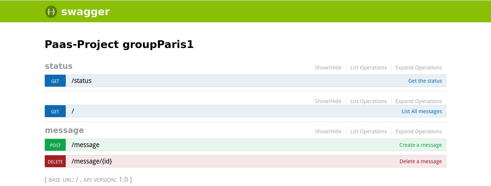

## [Project 0] Module Plateforme as a Service & IA

Cette infrastructure se compose des briques suivantes:
- un proxy nginx en tête 
- une base de donnée sql postgresql
- une base de donnée clé valeur (redis)
- une api simple :

### Requirements

* Node.js v8+ or Docker and Docker Compose
* Postgres running on local instance or Docker

### Running on localMachine

* Install dependencies - `npm i`
* Run project - `npm start`

### OR: Docker

* `docker-compose up --build`

### Viewing

* Go to swagger page - `localhost:3000/documentation`
